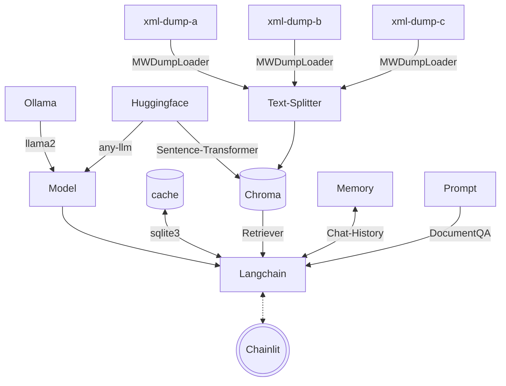

# Multi Mediawiki RAG Chatbot

[Chatbots](https://www.forbes.com/advisor/business/software/what-is-a-chatbot/) are very popular right now. Most openly accessible information is stored in some kind of a [Mediawiki](https://en.wikipedia.org/wiki/MediaWiki). Creating a [RAG](https://research.ibm.com/blog/retrieval-augmented-generation-RAG) Chatbot is becoming a very powerful alternative to traditional data gathering. This project is designed to create a basic format for creating your own chatbot to run locally on linux.

## Table of Contents

- [Multi Mediawiki RAG Chatbot](#multi-mediawiki-rag-chatbot)
  - [Table of Contents](#table-of-contents)
  - [About](#about)
    - [Architecture](#architecture)
    - [Filesystem](#filesystem)
    - [System Prompt](#system-prompt)
  - [Quickstart](#quickstart)
    - [Prerequisites](#prerequisites)
    - [Create Vector Database](#create-vector-database)
      - [Expected Output](#expected-output)
    - [Start Chatbot](#start-chatbot)

## About

[Mediawikis](https://en.wikipedia.org/wiki/MediaWiki) hosted by [Fandom](https://www.fandom.com/) usually allow you to download an XML dump of the entire wiki as it currently exists. This project primarily leverages [Langchain](https://github.com/langchain-ai/langchain) with a few other open source projects to combine many of the readily available quickstart guides into a complete vertical application based on mediawiki data.

### Architecture



### Filesystem

```text
multi-mediawiki-rag
├── .chainlit
│   ├── .langchain.db
│   └── config.toml
├── .env
├── Dockerfile
├── chainlit.md
├── config.yaml
├── data
│   ├── *
│   └── chroma.sqlite3
├── main.py
├── memory
│   └── cache.db
├── model
│   └── sentence-transformers_all-MiniLM-L6-v2
│       └── *
├── requirements.txt
└── sources
    ├── <wikiname>_pages_current.xml
    └── *
```

### System Prompt

```text
Given the following extracted parts of a long document and a question, create a final answer with references ("SOURCES"). 
If you don't know the answer, just say that you don't know. Don't try to make up an answer.
ALWAYS return a "SOURCES" part in your answer.
---
Content: {context}
---
```

## Quickstart

These instructions will get you a copy of the project up and running on your local machine for development and testing purposes.

### Prerequisites

These steps assume you are using a modern Linux OS like Ubuntu with Python 3.

1. Download a mediawiki's XML dump by browsing to `/wiki/Special:Statistics`.
2. Edit [`config.yaml`](config.yaml) with the location of your XML mediawiki data, wiki name, and example prompt to test on the wiki.
   1. You can choose to download your LLM during runtime from [Huggingface]("https://huggingface.co/") or locally before with [Ollama](https://github.com/jmorganca/ollama). (`ollama pull llama2`)
3. Install python requirements:

```bash
pip install -r requirements.txt
```

### Create Vector Database

Your XML data needs to be loaded and transformed into embeddings to create a [Chroma](https://python.langchain.com/docs/integrations/vectorstores/chroma) VectorDB.

```bash
python main.py
```

>**Note:** Use an existing vectorDB by adding `--no-embed`

#### Expected Output

- Prompt: "What is a Tako?"

```text
2023-12-15 22:09:21 - Loaded .env file
2023-12-15 22:09:24 - Load pretrained SentenceTransformer: sentence-transformers/all-MiniLM-L6-v2
2023-12-15 22:09:25 - Use pytorch device: cpu
2023-12-15 22:13:49 - Anonymized telemetry enabled. See https://docs.trychroma.com/telemetry
for more information.
Batches: 100%|███████████████████████████████████████████████| 1303/1303 [10:28<00:00,  2.07it/s] 
...

```

### Start Chatbot

```bash
chainlit run main.py -w
```

Access the Chatbot GUI at `http://localhost:8000`.
