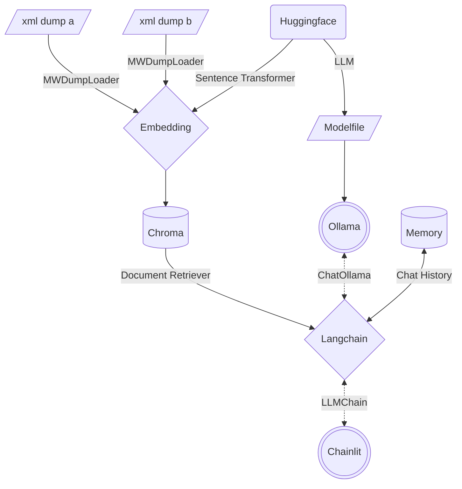

# Multi Mediawiki RAG Chatbot [](https://github.com/tylertitsworth/multi-mediawiki-rag) [](https://github.com/tylertitsworth/multi-mediawiki-rag)

[](https://www.linux.org/ "Go to Linux homepage")
[](https://python.org "Go to Python homepage")
[](https://github.com/tylertitsworth/multi-mediawiki-rag/blob/main/CONTRIBUTING.md)
[](https://github.com/tylertitsworth/multi-mediawiki-rag/issues)
[](https://www.bestpractices.dev/projects/8272)
[](https://github.com/tylertitsworth/multi-mediawiki-rag/actions?query=workflow:"Unit+Tests")

[Chatbots](https://www.forbes.com/advisor/business/software/what-is-a-chatbot/) are very popular right now. Most openly accessible information is stored in some kind of a [Mediawiki](https://en.wikipedia.org/wiki/MediaWiki). Creating a [RAG](https://research.ibm.com/blog/retrieval-augmented-generation-RAG) Chatbot is becoming a very powerful alternative to traditional data gathering. This project is designed to create a basic format for creating your own chatbot to run locally on linux.

## Table of Contents

- [Multi Mediawiki RAG Chatbot  ](#multi-mediawiki-rag-chatbot--)
  - [Table of Contents](#table-of-contents)
  - [About](#about)
    - [Architecture](#architecture)
    - [Filesystem](#filesystem)
  - [Quickstart](#quickstart)
    - [Prerequisites](#prerequisites)
    - [Create Custom LLM](#create-custom-llm)
      - [Use Model from Huggingface](#use-model-from-huggingface)
    - [Create Vector Database](#create-vector-database)
      - [Expected Output](#expected-output)
      - [Add Different Data to DB](#add-different-data-to-db)
    - [Start Chatbot](#start-chatbot)
    - [Unit Testing](#unit-testing)
  - [License](#license)

## About

[Mediawikis](https://en.wikipedia.org/wiki/MediaWiki) hosted by [Fandom](https://www.fandom.com/) usually allow you to download an XML dump of the entire wiki as it currently exists. This project primarily leverages [Langchain](https://github.com/langchain-ai/langchain) with a few other open source projects to combine many of the readily available quickstart guides into a complete vertical application based on mediawiki data.

### Architecture



### Filesystem

```txt
multi-mediawiki-rag
├── .chainlit
│   ├── .langchain.db # Server Cache
│   └── config.toml # Server Config
├── .env
├── Dockerfile
├── Modelfile
├── chainlit.md
├── config.yaml
├── data # VectorDB
│   ├── 47e4e036-****-****-****-************
│   │   └── *
│   └── chroma.sqlite3
├── main.py
├── memory
│   └── cache.db # Chat Cache
├── model
│   ├── <modelname>
│   │   ├── q4_0.bin
│   │   └── *
│   └── sentence-transformers_all-mpnet-base-v2
│       └── *
├── requirements.txt
└── sources
    ├── <wikiname>_pages_current.xml
    └── *
```

## Quickstart

These instructions will get you a copy of the project up and running on your local machine for development and testing purposes.

### Prerequisites

These steps assume you are using a modern Linux OS like Ubuntu with Python 3.10+.

1. Install [sqlite3](https://www.sqlite.org/index.html)
2. Download a mediawiki's XML dump by browsing to `/wiki/Special:Statistics` or using a tool like [wikiteam3](https://pypi.org/project/wikiteam3/)
    1. If Downloading, download only the current pages, not the entire history
    2. If using `wikiteam3`, scrape only namespace 0
    3. Provide in the following format: `sources/<wikiname>_pages_current.xml`
3. Install [Ollama](https://github.com/jmorganca/ollama) with `curl https://ollama.ai/install.sh | sh`
   1. Follow the manual setup instructions to set up Ollama as a systemd service
4. Edit [`config.yaml`](config.yaml) with the location of your XML mediawiki data you downloaded in step 1 and other configuration information
5. Create a directory to store chat history with `mkdir memory`
6. Install python requirements:

```bash
pip install -U pip setuptools wheel
pip install -r requirements.txt
```

### Create Custom LLM

After installing Ollama we can use a [Modelfile](https://github.com/jmorganca/ollama/blob/main/docs/modelfile.md) to download and tune an LLM to be more precise for Document Retrieval QA.

```bash
ollama create volo -f ./Modelfile
```

#### Use Model from Huggingface

1. Download a model of choice from [Huggingface](https://huggingface.co/spaces/HuggingFaceH4/open_llm_leaderboard) with `git clone https://huggingface.co/<org>/<modelname> model/<modelname>`.
2. If your model of choice is not in `GGUF` format, convert it with `docker run --rm -v $PWD/model/<modelname>:/model ollama/quantize -q q4_0 /model`.
3. Modify the [Modelfile's](Modelfile) `FROM` line to contain the path to the `q4_0.bin` file in the modelname directory.

### Create Vector Database

Your XML data needs to be loaded and transformed into embeddings to create a [Chroma](https://python.langchain.com/docs/integrations/vectorstores/chroma) VectorDB.

```bash
python main.py
```

>**Note:** Use an existing vectorDB by adding `--no-embed`

#### Expected Output

```txt
2023-12-16 09:50:53 - Loaded .env file
2023-12-16 09:50:55 - Load pretrained SentenceTransformer: sentence-transformers/all-mpnet-base-v2
2023-12-16 09:51:18 - Use pytorch device: cpu
2023-12-16 09:56:09 - Anonymized telemetry enabled. See
https://docs.trychroma.com/telemetry for more information.
Batches: 100%|████████████████████████████████████████| 1303/1303 [1:23:14<00:00,  3.83s/it]
...
Batches: 100%|████████████████████████████████████████| 1172/1172 [1:04:08<00:00,  3.28s/it]
023-12-16 19:47:01 - Load pretrained SentenceTransformer: sentence-transformers/all-mpnet-base-v2
2023-12-16 19:47:33 - Use pytorch device: cpu
Batches: 100%|████████████████████████████████████████████████| 1/1 [00:00<00:00, 40.41it/s]
A Tako was an intelligent race of octopuses found in the Kara-Tur setting. They were known for
their territorial nature and combat skills, as well as having incredible camouflaging abilities
that allowed them to blend into various environments. Takos lived in small tribes with a
matriarchal society led by one or two female rulers. Their diet consisted mainly of crabs,
lobsters, oysters, and shellfish, while their ink was highly sought after for use in calligraphy
within Kara-Tur.
```

#### Add Different Data to DB

Choose a new [File type Document Loader](https://python.langchain.com/docs/modules/data_connection/document_loaders/) or [App Document Loader](https://python.langchain.com/docs/integrations/document_loaders/) and include those files in your VectorDB.

```py
# main.py#L82-L103

Document = namedtuple("Document", ["page_content", "metadata"])
merged_documents = []

for dump in wiki.mediawikis:
    # https://python.langchain.com/docs/integrations/document_loaders/mediawikidump
    loader = MWDumpLoader(
        encoding="utf-8",
        file_path=f"{wiki.source}/{dump}_pages_current.xml",
        # https://www.mediawiki.org/wiki/Help:Namespaces
        namespaces=[0],
        skip_redirects=True,
        stop_on_error=False,
    )
    # For each Document provided:
    # Modify the source metadata by accounting for duplicates (<name>_n)
    # And add the mediawiki title (<name>_n - <wikiname>)
    merged_documents.extend(
        Document(
            doc.page_content, {"source": doc.metadata["source"] + f" - {dump}"}
        )
        for doc in rename_duplicates(loader.load())
    )
```

Insert a new loader

```py
from langchain.document_loaders import TextLoader
myloader = TextLoader("./mydocument.md")
merged_documents.append({"mydocument": myloader.load()})
```

[Re-embed](#create-vector-database) to include the new data for retrieval.

### Start Chatbot

```bash
chainlit run main.py -w -h
```

Access the Chatbot GUI at `http://localhost:8000`.

### Unit Testing

```bash
pip install pytest
# Basic Testing
pytest test/test.py -W ignore::DeprecationWarning
# With Ollama Model Backend
pytest test/test.py -W ignore::DeprecationWarning --ollama
```

## License

Released under [MIT](/LICENSE) by [@tylertitsworth](https://github.com/tylertitsworth).
