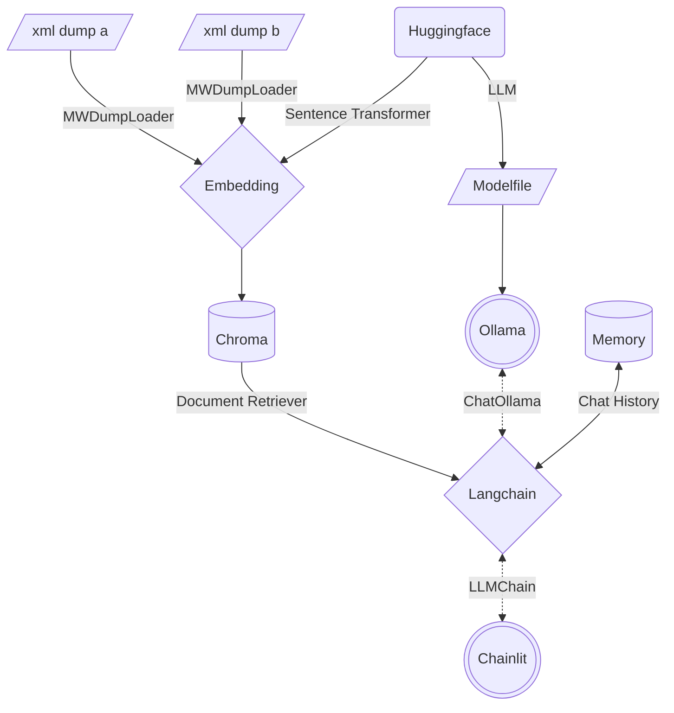

# Multi Mediawiki RAG Chatbot [](https://github.com/tylertitsworth/multi-mediawiki-rag) [](https://github.com/tylertitsworth/multi-mediawiki-rag)

[](https://www.linux.org/ "Go to Linux homepage")
[](https://python.org "Go to Python homepage")
[](https://huggingface.co/spaces/TotalSundae/dungeons-and-dragons)
[](https://github.com/tylertitsworth/multi-mediawiki-rag/blob/main/CONTRIBUTING.md)
[](https://www.bestpractices.dev/projects/8272)

[](https://github.com/tylertitsworth/multi-mediawiki-rag/actions/workflows/unit-test.yaml)
[](https://results.pre-commit.ci/latest/github/tylertitsworth/multi-mediawiki-rag/main)

[Chatbots](https://www.forbes.com/advisor/business/software/what-is-a-chatbot/) are very popular right now. Most openly accessible information is stored in some kind of a [Mediawiki](https://en.wikipedia.org/wiki/MediaWiki). Creating a [RAG](https://research.ibm.com/blog/retrieval-augmented-generation-RAG) Chatbot is becoming a very powerful alternative to traditional data gathering. This project is designed to create a basic format for creating your own chatbot to run locally on linux.

## Table of Contents

- [Multi Mediawiki RAG Chatbot  ](#multi-mediawiki-rag-chatbot--)
  - [Table of Contents](#table-of-contents)
  - [About](#about)
    - [Architecture](#architecture)
    - [Runtime Filesystem](#runtime-filesystem)
  - [Quickstart](#quickstart)
    - [Prerequisites](#prerequisites)
    - [Create Custom LLM](#create-custom-llm)
      - [Use Model from Huggingface](#use-model-from-huggingface)
    - [Create Vector Database](#create-vector-database)
      - [Expected Output](#expected-output)
      - [Add Different Document Type to DB](#add-different-document-type-to-db)
    - [Start Chatbot](#start-chatbot)
    - [Start Discord Bot](#start-discord-bot)
  - [Testing](#testing)
    - [Cypress](#cypress)
    - [Pytest](#pytest)
  - [License](#license)

## About

[Mediawikis](https://en.wikipedia.org/wiki/MediaWiki) hosted by [Fandom](https://www.fandom.com/) usually allow you to download an XML dump of the entire wiki as it currently exists. This project primarily leverages [Langchain](https://github.com/langchain-ai/langchain) with a few other open source projects to combine many of the readily available quickstart guides into a complete vertical application based on mediawiki data.

### Architecture



### Runtime Filesystem

```txt
multi-mediawiki-rag
├── .chainlit
│   ├── .langchain.db # Server Cache
│   └── config.toml # Server Config
├── chainlit.md
├── config.yaml
├── data # VectorDB
│   ├── 47e4e036-****-****-****-************
│   │   └── *
│   └── chroma.sqlite3
├── app.py
├── discord.py
├── embed.py
├── memory
│   └── cache.db # Chat Cache
└── model
    └── sentence-transformers_all-mpnet-base-v2
        └── *
```

## Quickstart

These instructions will get you a copy of the project up and running on your local machine for development and testing purposes.

### Prerequisites

These steps assume you are using a modern Linux OS like [Ubuntu 22.04](https://www.releases.ubuntu.com/jammy/) with [Python 3.10+](https://www.python.org/downloads/release/python-3100/).

```bash
apt-get install -y curl git python3-venv sqlite3
git clone https://github.com/tylertitsworth/multi-mediawiki-rag.git
curl https://ollama.ai/install.sh | sh
python -m .venv venv
source .venv/bin/activate
pip install -U pip setuptools wheel
pip install -r requirements.txt
```

1. Run the above setup steps
2. Download a mediawiki's XML dump by browsing to `/wiki/Special:Statistics` or using a tool like [wikiteam3](https://pypi.org/project/wikiteam3/)
    1. If Downloading, download only the current pages, not the entire history
    2. If using `wikiteam3`, scrape only namespace 0
    3. Provide in the following format: `sources/<wikiname>_pages_current.xml`
3. Edit [`config.yaml`](config.yaml) with the location of your XML mediawiki data you downloaded in step 1 and other configuration information

> [!CAUTION]
> Installing [Ollama](https://github.com/jmorganca/ollama) will create a new user and a service on your system. Follow the [manual installation steps](https://github.com/jmorganca/ollama/blob/main/docs/linux.md#manual-install) to avoid this step and instead launch the ollama API using `ollama serve`.

### Create Custom LLM

After installing Ollama we can use a [Modelfile](https://github.com/jmorganca/ollama/blob/main/docs/modelfile.md) to download and tune an LLM to be more precise for Document Retrieval QA.

```bash
ollama create volo -f ./Modelfile
```

> [!TIP]
> Choose a model from the [Ollama model library](https://ollama.ai/library) and download with `ollama pull <modelname>:<version>`, then edit the `model` field in [`config.yaml`](config.yaml) with the same information.

#### Use Model from Huggingface

1. Download a model of choice from [Huggingface](https://huggingface.co/spaces/HuggingFaceH4/open_llm_leaderboard) with `git clone https://huggingface.co/<org>/<modelname> model/<modelname>`.
2. If your model of choice is not in `GGUF` format, convert it with `docker run --rm -v $PWD/model/<modelname>:/model ollama/quantize -q q4_0 /model`.
3. Modify the [Modelfile's](Modelfile) `FROM` line to contain the path to the `q4_0.bin` file in the modelname directory.

### Create Vector Database

Your XML data needs to be loaded and transformed into embeddings to create a [Chroma](https://python.langchain.com/docs/integrations/vectorstores/chroma) VectorDB.

```bash
python embed.py
```

#### Expected Output

```txt
2023-12-16 09:50:53 - Loaded .env file
2023-12-16 09:50:55 - Load pretrained SentenceTransformer: sentence-transformers/all-mpnet-base-v2
2023-12-16 09:51:18 - Use pytorch device: cpu
2023-12-16 09:56:09 - Anonymized telemetry enabled. See
https://docs.trychroma.com/telemetry for more information.
Batches: 100%|████████████████████████████████████████| 1303/1303 [1:23:14<00:00,  3.83s/it]
...
Batches: 100%|████████████████████████████████████████| 1172/1172 [1:04:08<00:00,  3.28s/it]
023-12-16 19:47:01 - Load pretrained SentenceTransformer: sentence-transformers/all-mpnet-base-v2
2023-12-16 19:47:33 - Use pytorch device: cpu
Batches: 100%|████████████████████████████████████████████████| 1/1 [00:00<00:00, 40.41it/s]
A Tako was an intelligent race of octopuses found in the Kara-Tur setting. They were known for
their territorial nature and combat skills, as well as having incredible camouflaging abilities
that allowed them to blend into various environments. Takos lived in small tribes with a
matriarchal society led by one or two female rulers. Their diet consisted mainly of crabs,
lobsters, oysters, and shellfish, while their ink was highly sought after for use in calligraphy
within Kara-Tur.
```

#### Add Different Document Type to DB

Choose a new [File type Document Loader](https://python.langchain.com/docs/modules/data_connection/document_loaders/) or [App Document Loader](https://python.langchain.com/docs/integrations/document_loaders/), and add them using your own script. Check out the provided [Example](examples/add_more_docs.py).

### Start Chatbot

```bash
chainlit run app.py -h
```

Access the Chatbot GUI at `http://localhost:8000`.

### Start Discord Bot

```bash
export DISCORD_BOT_TOKEN=...
chainlit run app.py -h
```

> [!TIP]
> Develop locally with [ngrok](https://dashboard.ngrok.com/get-started/setup/linux).

## Testing

### Cypress

[Cypress](https://www.cypress.io/) tests modern web applications with visual debugging. It is used to test the [Chainlit](https://github.com/Chainlit/chainlit) UI functionality.

```bash
npm install
# Run Test Suite
bash cypress/test.sh
```

> [!NOTE]
> Cypress requires `node >= 16`.

### Pytest

[Pytest](https://docs.pytest.org/en/7.4.x/) is a mature full-featured Python testing tool that helps you write better programs.

```bash
pip install pytest
# Test Embedding Functions
pytest test/test_embed.py -W ignore::DeprecationWarning
# Test e2e with Ollama Backend
pytest test -W ignore::DeprecationWarning
```

## License

[](https://app.fossa.com/projects/git%2Bgithub.com%2Ftylertitsworth%2Fmulti-mediawiki-rag?ref=badge_large&issueType=license)
