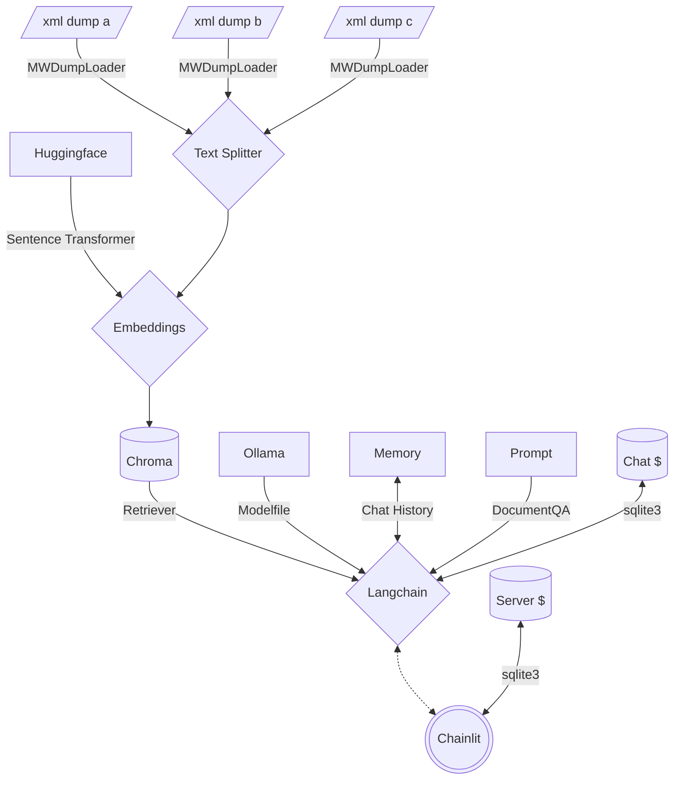

<!--- huggingface spaces metadata
---
colorFrom: red
colorTo: gray
license: mit
pinned: true
sdk: docker
startup_duration_timeout: 6h
title: Multi Mediawiki RAG
---
--->
# Multi Mediawiki RAG Chatbot

[Chatbots](https://www.forbes.com/advisor/business/software/what-is-a-chatbot/) are very popular right now. Most openly accessible information is stored in some kind of a [Mediawiki](https://en.wikipedia.org/wiki/MediaWiki). Creating a [RAG](https://research.ibm.com/blog/retrieval-augmented-generation-RAG) Chatbot is becoming a very powerful alternative to traditional data gathering. This project is designed to create a basic format for creating your own chatbot to run locally on linux.

## Table of Contents

- [Multi Mediawiki RAG Chatbot](#multi-mediawiki-rag-chatbot)
  - [Table of Contents](#table-of-contents)
  - [About](#about)
    - [Architecture](#architecture)
    - [Filesystem](#filesystem)
    - [System Prompt](#system-prompt)
  - [Quickstart](#quickstart)
    - [Prerequisites](#prerequisites)
    - [Create Custom LLM](#create-custom-llm)
    - [Create Vector Database](#create-vector-database)
      - [Expected Output](#expected-output)
    - [Start Chatbot](#start-chatbot)

## About

[Mediawikis](https://en.wikipedia.org/wiki/MediaWiki) hosted by [Fandom](https://www.fandom.com/) usually allow you to download an XML dump of the entire wiki as it currently exists. This project primarily leverages [lc](https://github.com/langchain-ai/langchain) with a few other open source projects to combine many of the readily available quickstart guides into a complete vertical application based on mediawiki data.

### Architecture



>**Note:** The server cache stores previously asked questions between sessions whereas the chat cache stores answers between sessions.

### Filesystem

```text
multi-mediawiki-rag
├── .chainlit
│   ├── .langchain.db # Server Cache
│   └── config.toml # Server Config
├── .env
├── Dockerfile
├── Modelfile
├── chainlit.md
├── config.yaml
├── data # VectorDB
│   ├── 47e4e036-****-****-****-************
│   │   └── *
│   └── chroma.sqlite3
├── main.py
├── memory
│   └── cache.db # Chat Cache
├── model
│   └── sentence-transformers_all-mpnet-base-v2
│       └── *
├── requirements.txt
└── sources
    ├── <wikiname>_pages_current.xml
    └── *
```

### System Prompt

```text
Given the following extracted parts of a long document and a question, create a final answer with references ("SOURCES"). 
If you don't know the answer, just say that you don't know. Don't try to make up an answer.
ALWAYS return a "SOURCES" part in your answer.
---
Content: {context}
---
```

## Quickstart

These instructions will get you a copy of the project up and running on your local machine for development and testing purposes.

### Prerequisites

These steps assume you are using a modern Linux OS like Ubuntu with Python 3.

1. Download a mediawiki's XML dump by browsing to `/wiki/Special:Statistics`.
2. Install [Ollama](https://github.com/jmorganca/ollama) with `curl https://ollama.ai/install.sh | sh`.
3. Edit [`config.yaml`](config.yaml) with the location of your XML mediawiki data and other configuration data.
4. Install python requirements:

```bash
pip install -r requirements.txt
```

### Create Custom LLM

After installing Ollama we can use a [Modelfile](https://github.com/jmorganca/ollama/blob/main/docs/modelfile.md) to download and tune an LLM to be more precise for Document Retrieval QA.

```bash
ollama create volo -f ./Modelfile
```

### Create Vector Database

Your XML data needs to be loaded and transformed into embeddings to create a [Chroma](https://python.langchain.com/docs/integrations/vectorstores/chroma) VectorDB.

```bash
python main.py
```

>**Note:** Use an existing vectorDB by adding `--no-embed`

#### Expected Output

```text
2023-12-16 09:50:53 - Loaded .env file
2023-12-16 09:50:55 - Load pretrained SentenceTransformer: sentence-transformers/all-mpnet-base-v2
2023-12-16 09:51:18 - Use pytorch device: cpu
2023-12-16 09:56:09 - Anonymized telemetry enabled. See 
https://docs.trychroma.com/telemetry for more information.
Batches: 100%|████████████████████████████████████████| 1303/1303 [1:23:14<00:00,  3.83s/it]
Batches: 100%|████████████████████████████████████████| 1303/1303 [1:17:04<00:00,  3.55s/it]
Batches: 100%|████████████████████████████████████████| 1303/1303 [1:12:07<00:00,  3.32s/it]
Batches: 100%|████████████████████████████████████████| 1303/1303 [1:11:02<00:00,  3.27s/it]
Batches: 100%|████████████████████████████████████████| 1303/1303 [1:08:30<00:00,  3.15s/it]
Batches: 100%|████████████████████████████████████████| 1172/1172 [1:04:08<00:00,  3.28s/it]
023-12-16 19:47:01 - Load pretrained SentenceTransformer: sentence-transformers/all-mpnet-base-v2
2023-12-16 19:47:33 - Use pytorch device: cpu
Batches: 100%|████████████████████████████████████████████████| 1/1 [00:00<00:00, 40.41it/s]
A Tako was an intelligent race of octopuses found in the Kara-Tur setting. They were known for
their territorial nature and combat skills, as well as having incredible camouflaging abilities
that allowed them to blend into various environments. Takos lived in small tribes with a
matriarchal society led by one or two female rulers. Their diet consisted mainly of crabs,
lobsters, oysters, and shellfish, while their ink was highly sought after for use in calligraphy
within Kara-Tur.['Tako () were a race of intelligent octopuses found in Kara-Tur.\n\nDescription\n
Tako resembled regular octopuses but with larger proportions. They had thick, leathery skin that
was red-orange in color for adult females and light green for the smaller adult males.  \nCombat\n
Takos were territorial and would not hesitate to defend their territory. The males were tasked with
the defense of their tribes territory. They were capable of wielding a different weapon with each
tentacle, with their weapons of choice being small axes, spears and tridents. Additionally, they
used their sharp, parrot-like beaks as weapons. Their tentacles were powerful enough to constrict
an opponent.\n\nAbilities\nTakos had incredible natural camouflaging abilities. By altering the
color of the skin and mantle, they blended seamlessly with their surroundings. Although they could
expel a blue ink into the water, but it offered little defensive capability.', 'Society\nTakos lived
in small tribes. Their society was matriarchal, each tribe ruled by one or a pair of females. The
rest of the tribe usually consisted of up to a dozen males and a half dozen youths.\n\nTakos were
believed to be the descendants of the batrachi.\nDiet\nAs carnivores, their diet usually consisted
of crabs, lobsters, oysters and shellfish.\n\nHabitats\nTako tribes lived in large submarine caves in
the coastal regions of Kara-Tur.\nLanguages\nTakos did not communicate verbally, instead their
language was based on the movements of their tentacles and coloration changes in their skin. Only the
most intelligent of humanoids were able to communicate with takos.\nRelationships\nOccasionally tako
tribes would raid a coastal human village for food, treasure or weapons. Though some tribes
co-existed peacefully with nearby humans.\nUsages\nThe ink produced by a tako was highly sought after
in Kara-Tur, where it was used in calligraphy.\n\nAppendix\nAppearances\n\nReferences\n\n
Category:Mollusks', "Tak might refer to:\n Tak, a doppelganger in the Moonsea.\n Tak, a goblin raider
on the Sword Coast.\n Tak, a halfling member of the Dungsweepers' Guild of Waterdeep.", "Takako was a
human ninja of Kara-Tur in the mid–14 century DR.\n\nHistory\nAs a teenager, Takako disguised herself
as a man and a tutor took her on as a student in the skills of the ninja. Although Takako became an
expert and agile warrior, she maintained her disguise as she worried no one would hire her for
dangerous missions if they found out the truth.\n\nShe once fought with the warrior Masakito.This is
inferred from the art used for both characters' cards being reused from the cover of Night of the
Seven Swords.\n\nPersonality\nTakako was a thrill-seeker who enjoyed being in any kind of danger.\n\n
Possessions\nTakako wielded a katana.\n\nAppendix\nNotes\n\nReferences\n\nCategory:Fighters\n
Category:Ninja\nCategory:Humans\nCategory:Females\nCategory:Inhabitants of Kara-Tur\n
Category:Inhabitants of Toril\nCategory:Inhabitants of lawful good alignment"]
```

### Start Chatbot

```bash
chainlit run main.py -w -h
```

Access the Chatbot GUI at `http://localhost:8000`.
