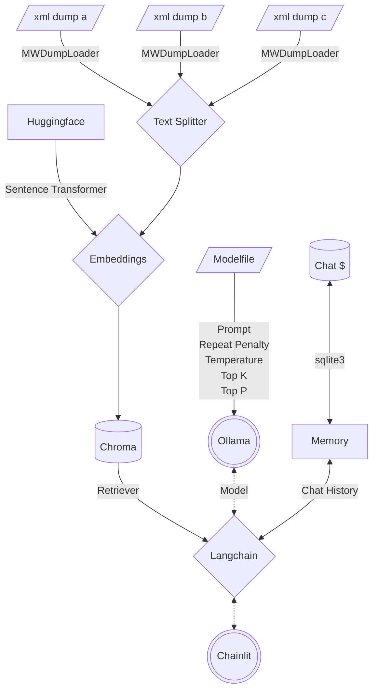

<!--- huggingface spaces metadata
---
colorFrom: red
colorTo: gray
license: mit
pinned: true
sdk: docker
title: Multi Mediawiki RAG
---
--->
# Multi Mediawiki RAG Chatbot

[Chatbots](https://www.forbes.com/advisor/business/software/what-is-a-chatbot/) are very popular right now. Most openly accessible information is stored in some kind of a [Mediawiki](https://en.wikipedia.org/wiki/MediaWiki). Creating a [RAG](https://research.ibm.com/blog/retrieval-augmented-generation-RAG) Chatbot is becoming a very powerful alternative to traditional data gathering. This project is designed to create a basic format for creating your own chatbot to run locally on linux.

## Table of Contents

- [Multi Mediawiki RAG Chatbot](#multi-mediawiki-rag-chatbot)
  - [Table of Contents](#table-of-contents)
  - [About](#about)
    - [Architecture](#architecture)
    - [Filesystem](#filesystem)
    - [System Prompt](#system-prompt)
  - [Quickstart](#quickstart)
    - [Prerequisites](#prerequisites)
    - [Create Custom LLM](#create-custom-llm)
    - [Create Vector Database](#create-vector-database)
      - [Expected Output](#expected-output)
    - [Start Chatbot](#start-chatbot)

## About

[Mediawikis](https://en.wikipedia.org/wiki/MediaWiki) hosted by [Fandom](https://www.fandom.com/) usually allow you to download an XML dump of the entire wiki as it currently exists. This project primarily leverages [Langchain](https://github.com/langchain-ai/langchain) with a few other open source projects to combine many of the readily available quickstart guides into a complete vertical application based on mediawiki data.

### Architecture



### Filesystem

```text
multi-mediawiki-rag
├── .chainlit
│   ├── .langchain.db # Server Cache
│   └── config.toml # Server Config
├── .env
├── Dockerfile
├── Modelfile
├── chainlit.md
├── config.yaml
├── data # VectorDB
│   ├── 47e4e036-****-****-****-************
│   │   └── *
│   └── chroma.sqlite3
├── main.py
├── memory
│   └── cache.db # Chat Cache
├── model
│   ├── <modelname>
│   │   ├── q4_0.bin
│   │   └── *
│   └── sentence-transformers_all-mpnet-base-v2
│       └── *
├── requirements.txt
└── sources
    ├── <wikiname>_pages_current.xml
    └── *
```

### System Prompt

```text
Given the following extracted parts of a long document and a question, create a final answer with references ("SOURCES"). 
If you don't know the answer, just say that you don't know. Don't try to make up an answer.
ALWAYS return a "SOURCES" part in your answer.
---
Content: {context}
---
```

## Quickstart

These instructions will get you a copy of the project up and running on your local machine for development and testing purposes.

### Prerequisites

These steps assume you are using a modern Linux OS like Ubuntu with Python 3.

1. Download a mediawiki's XML dump by browsing to `/wiki/Special:Statistics`.
2. (Optional)
   1. Install [Git LFS](https://docs.github.com/en/repositories/working-with-files/managing-large-files/installing-git-large-file-storage?platform=linux)
   2. download your model of choice from [Huggingface](https://huggingface.co/spaces/HuggingFaceH4/open_llm_leaderboard) with `git clone https://huggingface.co/<org>/<modelname> model/<modelname>`.
   3. Modify [Modelfile](Modelfile) to point to the same directory as your modelname of choice.
3. Install [Ollama](https://github.com/jmorganca/ollama) with `curl https://ollama.ai/install.sh | sh`.
4. Edit [`config.yaml`](config.yaml) with the location of your XML mediawiki data you downloaded in step 1 and other configuration data.
5. Edit [`Modelfile`](Modelfile) with the location of the model you downloaded in step 2.
6. Create a directory to store chat history with `mkdir memory`.
7. Install python requirements:

```bash
pip install -U pip setuptools wheel
pip install -r requirements.txt
```

>**Note:** To properly install Chroma, you might need to install a newer version of [sqlite3](https://www.sqlite.org/download.html).

### Create Custom LLM

After installing Ollama we can use a [Modelfile](https://github.com/jmorganca/ollama/blob/main/docs/modelfile.md) to download and tune an LLM to be more precise for Document Retrieval QA.

```bash
ollama create volo -f ./Modelfile
# Test the model
ollama run volo "Hello World"
```

>**Note:** If your model of choice is not in `GGUF` format, you can convert it with docker via `docker run --rm -v $PWD/model/<modelname>:/model ollama/quantize -q q4_0 /model`.

### Create Vector Database

Your XML data needs to be loaded and transformed into embeddings to create a [Chroma](https://python.langchain.com/docs/integrations/vectorstores/chroma) VectorDB.

```bash
python main.py
```

>**Note:** Use an existing vectorDB by adding `--no-embed`

#### Expected Output

```text
2023-12-16 09:50:53 - Loaded .env file
2023-12-16 09:50:55 - Load pretrained SentenceTransformer: sentence-transformers/all-mpnet-base-v2
2023-12-16 09:51:18 - Use pytorch device: cpu
2023-12-16 09:56:09 - Anonymized telemetry enabled. See 
https://docs.trychroma.com/telemetry for more information.
Batches: 100%|████████████████████████████████████████| 1303/1303 [1:23:14<00:00,  3.83s/it]
...
Batches: 100%|████████████████████████████████████████| 1172/1172 [1:04:08<00:00,  3.28s/it]
023-12-16 19:47:01 - Load pretrained SentenceTransformer: sentence-transformers/all-mpnet-base-v2
2023-12-16 19:47:33 - Use pytorch device: cpu
Batches: 100%|████████████████████████████████████████████████| 1/1 [00:00<00:00, 40.41it/s]
A Tako was an intelligent race of octopuses found in the Kara-Tur setting. They were known for
their territorial nature and combat skills, as well as having incredible camouflaging abilities
that allowed them to blend into various environments. Takos lived in small tribes with a
matriarchal society led by one or two female rulers. Their diet consisted mainly of crabs,
lobsters, oysters, and shellfish, while their ink was highly sought after for use in calligraphy
within Kara-Tur.
```

### Start Chatbot

```bash
chainlit run main.py -w -h
```

Access the Chatbot GUI at `http://localhost:8000`.

### Unit Testing

```bash
pip install pytest
# Basic Testing
PYTHONPATH=test pytest test/test.py -W ignore::DeprecationWarning
# With Embedding
PYTHONPATH=test pytest test/test.py -W ignore::DeprecationWarning --embed
# With Ollama Model Backend
PYTHONPATH=test pytest test/test.py -W ignore::DeprecationWarning --ollama
```
